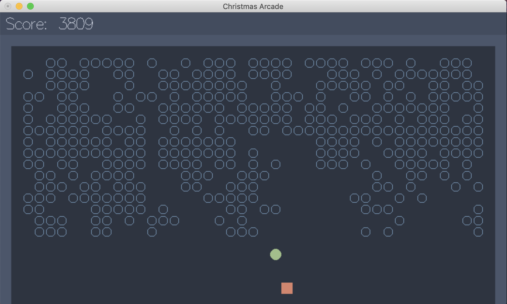

# AoC2019

### Solutions to advent of code 2019

Add your session key to sessionKey.txt

`echo -n "123456789abcdef..." > sessionKey.txt`

Exercises numbered `1a` - `25b`, to run `1a`

- solve `./run solve 1a`
- test with file watch `./run test 1a`
- benchmark with file watch `./run bench 1a`

